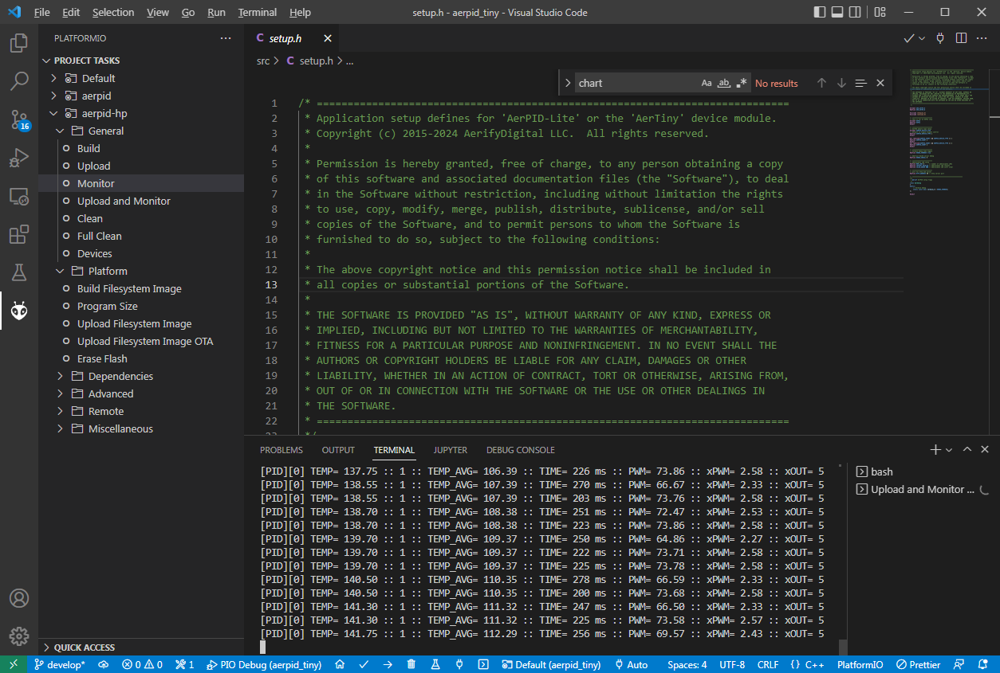

# Debug Console Usage

The debug console may be accessed from the USB port when plugged into a PC or supported device.

## DEBUG Mode Enable

- Press the `Coil Enable` button 3 time fast
- If successful, a "DEBUG" icon will appear on the top-right of the screen

## Required Resources

- Supported Interface Device (PC)
  - Windows 7 or above, MAC, or Linux
- [VSCode](https://code.visualstudio.com/) installed
- [PlatformIO](https://platformio.org/install/ide?install=vscode) extention installed for VSCode
- AerPID3 [source code](https://github.com/Aerify-Digital/AerPID3/) cloned locally
- USB [Driver](https://ftdichip.com/drivers/vcp-drivers/) *for FTDI FT231X*
  - Installed as Virtual COM Port
- USB Cable connected between device and computer

## Serial Console Monitor

:::info[NOTE]
*DEBUG mode is not required for the Serial monitor.*
:::

- Open the `AerPID3` project using VSCode.
  - PlatformIO will automattically download and install all requried resources
  - *Please wait for the project to initialize*
- On the LEFT side of your VSCode window, Click the Ant icon. 
- Under `PROJECT TASKS`, expand the `aerpid` section
- Navigate to and expand `General` section
- To attach the monitor, Click "Monitor" under the `General` section
- The Monitor should attach if the COM port is found
- To detach the monitor, press CTRL+C when the console is selected

### Example

When Attached, your VSCode window might look something like this:
