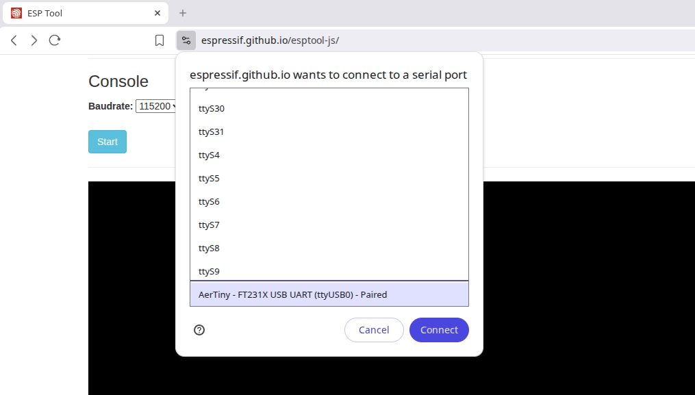
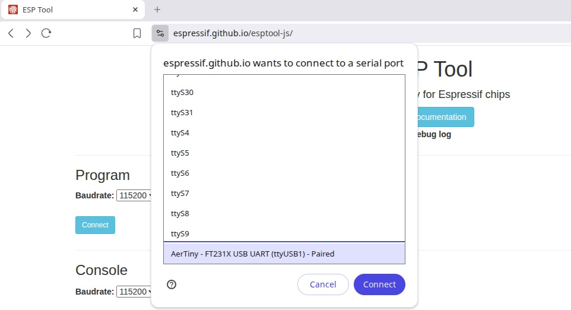
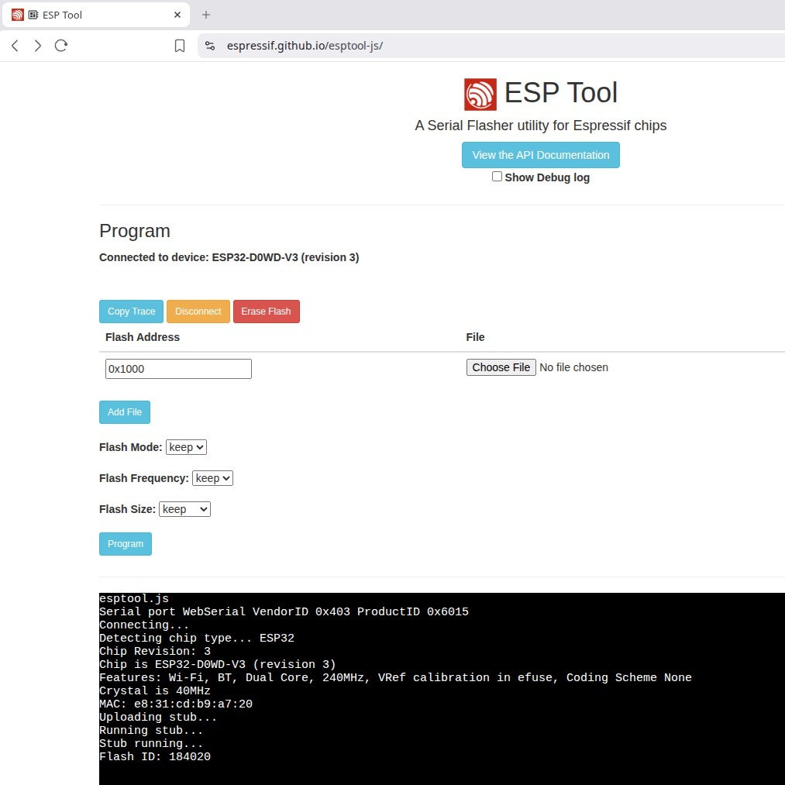
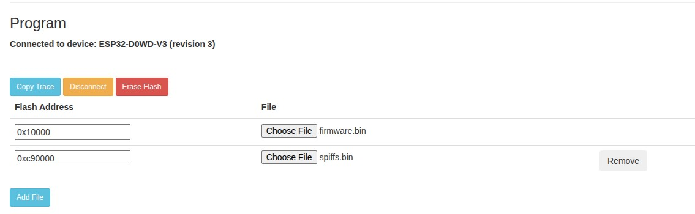
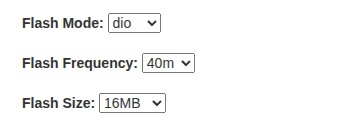
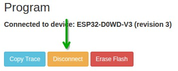

# Updating Firmware - Web

This will guide you through updating the device firmware using the web tool `esptool-js` to flash your device.

:::info[NOTE]
Please assure you have all the [Required Resources](#required-resources) before you begin.
:::

### Setup Steps
- Connect device to PC using USB cable
- Assure device is in `Debug Mode`
- Navigate to https://espressif.github.io/esptool-js/ on your PC

### Verify Connection - Console
- (Optional) *This might not work easily*
- Open https://espressif.github.io/esptool-js/
- Navigate to the section label `Console`
- Press `Start`

- You should then see Serial Monitor output on the console

### Flash Firmware - Program
- Open https://espressif.github.io/esptool-js/
- Navigate to the section label `Program`
- Change the `Baudrate` to `115200`

- Press `Connect` to begin the connection to the device
- Select your device from the list of USB devices found

- You should now see something like this...

- Add and setup the files to upload
  - Press `Add File` to add another file
  - You should have two section for files to uplaod

- Locate the appropiate files from your file system

:::info[NOTE]
The firmware files are located in the `Assets` section on the [AerPID3](https://github.com/Aerify-Digital/AerPID3/releases) project release page.
:::
:::info[HINT]
The Flash Address locations can be found in the [`aerpid_spiffs.csv`](https://github.com/Aerify-Digital/AerPID3/blob/master/aerpid_spiffs.csv) file within the project sources.
:::

- Assure the files are uploaded to the correct Flash Address:
  - `firmware.bin` is located at Flash Address `0x10000`
  - `spiffs.bin` is located at Flash Addres `0xc90000`
- Verify and set the `Flash Mode`, `Flash Frequency` and `Flash Size`

- Flash Setup Parameters:
  - `Flash Mode` set to `dio`
  - `Flash Frequency` set to `40m`
  - `Flash Size` set to `16MB`
- Press `Program`
- If everything is correct; You will see it writing and a progress percentage scrolling by
- Please Wait for this to finish...

:::info[NOTE]
The flash upload process may take a couple minutes to complete.
:::

- Once complete; Press `Discconect` to detach the programmer

- Power cycle the device and verify the correct version was flashed
- You should now have completed the update to the firmware on your device

## Required Resources

- Supported Interface Device (PC)
  - Windows 7 or above, MAC, or Linux
- Web Tool: https://espressif.github.io/esptool-js/
- USB [Driver](https://ftdichip.com/drivers/vcp-drivers/) *for FTDI FT231X*
  - Installed as Virtual COM Port
- USB Cable connected between device and computer
- [`DEBUG` Mode](/docs/pages/aertiny/dev-adv/debug) eneabled on your device